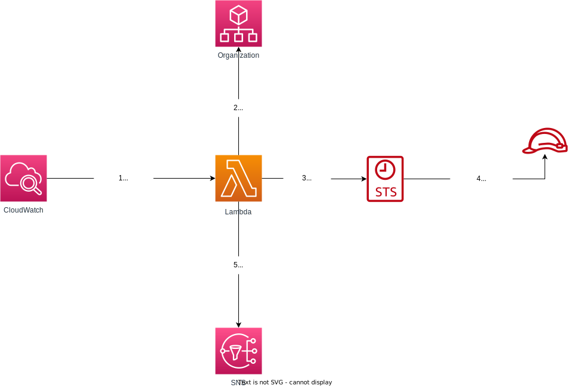

```
╔═╗╦ ╦╔═╗  ╔═╗╦═╗╔═╗╔═╗╔═╗  ╔═╗╔═╗╔═╗╔═╗╦ ╦╔╗╔╔╦╗  ╔═╗╦ ╦╔═╗╔═╗╦╔═╔═╗╦═╗
╠═╣║║║╚═╗  ║  ╠╦╝║ ║╚═╗╚═╗  ╠═╣║  ║  ║ ║║ ║║║║ ║   ║  ╠═╣║╣ ║  ╠╩╗║╣ ╠╦╝
╩ ╩╚╩╝╚═╝  ╚═╝╩╚═╚═╝╚═╝╚═╝  ╩ ╩╚═╝╚═╝╚═╝╚═╝╝╚╝ ╩   ╚═╝╩ ╩╚═╝╚═╝╩ ╩╚═╝╩╚═
                                                                          
```
### Overview
This project was created as a way to help cloud security professionals identify and protect the environments from unauthorized role cross-account. 



### Environment Variables
To right execution of this code you must configure the variables below:

| Name                          | Value                                                        | Description                                             |
|-------------------------------|--------------------------------------------------------------|---------------------------------------------------------|
| OrganizationAccountAccessRole | OrganizationAccountAccessRole                                | Name of role used to assume role in others account      |
| TopicArn                      | arn:aws:sns:us-east-1:111111111111:aws-cross-account-checker | Arn of topic used to send e-mails notification          |
| AuthorizedAccounts            | 111111111111,11111111112,11111111113,111111111114            | Accounts separated by comma                             |
| Action                        | delete                                                       | Just use the word delete to enable the flag Auto Delete |


### Backlog

- [] Send the report as csv attached: Here it's necessary to change the service sns

- [x] Environment list of allowed account's id

- [x] Automatic removal of roles with external accounts

- [] The Open Source license

- [] The new diagram

- [] Text of this project proposal

- [] Validate configs to execute